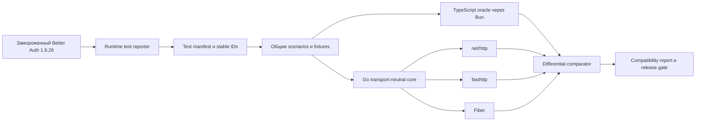

# Архивный план переноса Better Auth в Go-библиотеку `single-auth`

> **Исторический документ.** Цифры и этапы ниже фиксируют состояние на
> 2026-08-09 и не описывают текущую готовность проекта. Актуальные критерии,
> статус и остаток находятся в [плане реализации](../implementation-plan.md) и
> [списке оставшихся работ](../remaining-work.md).

Статус документа: архив исходного плана по frozen baseline Better Auth 1.6.26. Старый
`conformance/compatibility-map.json` сохраняет upstream traceability, но больше не
является счётчиком готовности продукта.

Неподвижное правило: `better-auth-main/` остаётся в рабочем дереве как
read-only эталон, пока перенос не завершён. Его нельзя удалять или включать в
runtime Go-тестов. Реализация переносится в Go, а применимые проверки — в
нативные Go-тесты.

> Scope уточнён 2026-08-09: готовность теперь измеряется нативными Go
> capabilities, а не one-to-one Vitest leaf. JS runtimes/clients/frameworks,
> TypeScript compile tests, billing integrations и повторяющиеся ORM harnesses
> исключены. Актуальные критерии находятся в
> [плане реализации](../implementation-plan.md);
> приведённый ниже upstream ledger является только историческим аудитом.

## 1. Цель и фиксированный baseline

Нужно создать Go-библиотеку с полной фактической совместимостью с локальным снимком Better Auth и с равнозначными входами для:

- стандартного `net/http`;
- прямого `fasthttp`;
- Fiber поверх `fasthttp`.

Baseline фиксируется до начала реализации:

| Параметр | Значение |
|---|---|
| Исходник | `better-auth-main/` |
| Версия пакетов | `1.6.26` |
| Git commit | отсутствует в распакованном снимке |
| SHA-256 дерева без `.git` и `.DS_Store` | `01f179b28c2de406e22388ec175234c6ae437bf437a8e8c34a8b3bfb51330521` |
| Workspace-пакеты | 20 |
| Публичные export subpaths | 102 по всем workspace-пакетам |
| HTTP API | 31 core endpoints и около 200 plugin endpoint declarations |
| Production TypeScript | 660 файлов, около 133 тысяч строк |
| Test/spec-файлы | 257, около 164 тысяч строк |
| Статические `it/test`-декларации | около 4 380; это только нижняя граница |
| Generated adapter contract | 6 340 зарегистрированных behavioral cases в 14 adapter/DB-конфигурациях; часть upstream-профилей урезана или disabled |
| Встроенные plugin-каталоги | 28 |
| Social providers | 35 |
| Документация | 180 MDX-файлов |

Статический счётчик не является критерием готовности: параметризованные тесты, циклы и общий adapter contract разворачиваются во много отдельных runtime-кейсов. Только adapter matrix регистрирует тысячи сценариев. Точное число и полные названия тестов нужно получить исполняемым reporter-ом в фазе 0.

Во время переноса baseline не обновляется вслед за upstream. Любое обновление Better Auth оформляется как отдельный следующий compatibility cycle.

### 1.1 Исторический прогресс Go scope на 2026-08-09

Этот архивный воспроизводимый snapshot был получен из
`conformance/capability-map.json` командой
`go run ./internal/conformance/cmd/capability-report`: 30 полностью закрытых
capability, 12 частичных и 0 отсутствующих из 42, то есть **71,4%**. Частичная
реализация не увеличивает процент. По группам: core HTTP 87,5%, transports
100%, native storage 100%, protocols/plugins 44,4%, Go client 75%.
Schema v2 фиксирует для всех 42 групп 42 structured observable contracts,
84 assertion strings, 62 explicit upstream paths и 141 exact case substring.
Обычная Go-валидация не читает upstream tree; отдельный read-only аудит
запускается явно через `-upstream-root .` и ничего из snapshot не исполняет.

Ниже сохранён только исторический one-to-one upstream leaf snapshot; он не
является readiness-метрикой текущего Go milestone.

Срез на 2026-08-09. Числитель включает только exact runtime ID со статусом
`passing`; companion-тесты, WIP и локальные эксперименты в него не входят.

| Категория | Passing | Всего | Покрытие | Осталось |
|---|---:|---:|---:|---:|
| HTTP | 1 553 | 2 824 | 54,99% | 1 271 |
| Direct API | 20 | 20 | 100,00% | 0 |
| Runtime/package smoke | 69 | 146 | 47,26% | 77 |
| Unit | 675 | 1 149 | 58,75% | 474 |
| Storage | 1 102 | 6 629 | 16,62% | 5 527 |
| Browser | 8 | 8 | 100,00% | 0 |
| Compile-time | 59 | 59 | 100,00% | 0 |
| **Итого** | **3 486** | **10 835** | **32,17%** | **7 349** |

Источник истины для этого исторического среза — `conformance/compatibility-map.json`.
Релизный критерий текущего Go scope определяется capability manifest из
[плана реализации](../implementation-plan.md); повторяющиеся и неприменимые JS/ORM leaf ID не
являются отдельными требованиями.

CLI Better Auth исключён из целевого продукта по решению владельца проекта.
Каталог Go-CLI удалён, а 331 runtime ID из `packages/cli/` не входят в текущий
manifest. Замороженный upstream-каталог сохраняется только как источник
эталонного поведения.

Обязательный Testcontainers E2E gate на этом срезе проходит в normal и race
режимах для MongoDB, MSSQL, MySQL, PostgreSQL и Redis; недоступный Docker при
`SINGLE_AUTH_E2E_REQUIRED=1` считается ошибкой, а не успешным skip.

## 2. Имя проекта

- Каноническое имя репозитория и библиотеки — `single-auth`.
- Публичный Go module path зафиксирован как `github.com/pers0na2dev/single-auth`.
- В `.go`-файлах корневой пакет называется `singleauth`, потому что дефис запрещён в Go-идентификаторах.

## 3. Что означает «100% compatibility»

Релиз считается полной копией фактических возможностей только при одновременном выполнении всех условий:

1. Каждый применимый runtime-тест исходного снимка имеет стабильный ID и строку в compatibility manifest; CLI-тесты явно исключены из scope.
2. Каждое уникальное применимое server-side поведение перенесено в Go и
   проверено нативным Go-тестом.
3. Browser/client/framework-only сценарии явно отложены и не входят в текущий
   Go milestone; серверные правила из них переносятся в обычный Go HTTP test.
4. Для каждого теста зафиксирован результат; неизвестных, потерянных и необъяснённо пропущенных кейсов нет.
5. HTTP-контракт совпадает по method/path, status, body, error code/message, redirect, multi-value headers и каждому `Set-Cookie`.
6. Совпадают DB/secondary-storage изменения, hook order, callbacks, emails, webhooks и background events.
7. Данные, cookies, hashes и tokens, созданные Better Auth, читаются Go-реализацией; созданные Go-реализацией читаются Better Auth.
8. Одинаковый transport-neutral corpus проходит через `net/http`, прямой `fasthttp` и Fiber.
9. Все адаптеры проходят общий storage contract, включая конкурентные и транзакционные сценарии.
10. В итоговом отчёте: `unmapped = 0`, `unknown = 0`, `unexpected_skip = 0`, `unexplained_diff = 0`.

### Ограничение буквального совпадения тестового исходника

TypeScript conditional types, `$Infer`, declaration merging, dynamic proxy API, diagnostics `tsc`, React/Solid/Vue/Svelte/Lynx hooks и Node/Bun/Deno/Cloudflare module-resolution нельзя запустить непосредственно над Go package. Аналогично Go не может принимать объекты Prisma, Drizzle или Kysely.

Поэтому «100%» реализуется как полная one-to-one traceability намерения и наблюдаемого поведения:

- server/wire/storage/crypto тесты переносятся или выполняются differential-образом;
- compile-time и framework-only TypeScript контракты помечаются как
  неприменимые к текущему Go scope;
- серверная часть смешанных JS/browser сценариев переносится в native Go test;
- ORM-специфичный API заменяется нативными Go adapters для тех же СУБД с тем же фактическим DB-контрактом.

Чистый Go-артефакт должен гарантировать полный server, wire-protocol и Go-client
compatibility. `compat/js`, Bun/Node runtime и JS framework harnesses не участвуют в
production graph или `go test`; новый JS client может быть отдельной следующей
фазой.

Названия TypeScript ORM (`Drizzle`, `Prisma`, `Kysely`) относятся только к
происхождению conformance-сценариев. Они не должны становиться публичными
Go-пакетами или пользовательскими зависимостями: проверяемая ими SQL/storage
семантика переносится в нативные адаптеры SQLite, PostgreSQL, MySQL, MSSQL и
MongoDB. В Go API и Go test names не должно оставаться compatibility packages
или aliases этих ORM.

## 4. Обязательный функциональный охват

### 4.1 Core runtime и конфигурация

- Инициализация full/minimal mode и immutable global context.
- Dynamic base URL, base path, app name, trusted origins/providers, proxy headers и IPv4/IPv6 resolution.
- Secrets, versioned secret rotation и legacy-secret compatibility.
- Endpoint registry, конфликт `path + method`, server-only endpoints и disabled paths.
- Request/response lifecycle, middleware, user hooks, plugin hooks, `onRequest` и `onResponse` в исходном порядке.
- Валидация, coercion, defaults, различие missing/null/zero value и точная форма ошибок.
- CSRF/origin checks, Fetch Metadata, redirects, error page и custom error handling.
- Cookies: prefix/domain/path/security attributes, signing, chunking, cross-subdomain behavior.
- Sessions: stateful/stateless режимы, freshness, refresh, revocation и cookie cache `compact`/JWT/JWE.
- Rate limits: memory/database/secondary/custom stores, proxy-aware IP и custom rules.
- Logger, telemetry/instrumentation, background tasks и cancellation.
- Database lifecycle hooks для user/session/account/verification.

### 4.2 Базовые модели и API

Модели: `user`, `session`, `account`, `verification`, опциональный `rateLimit`, дополнительные поля и plugin schemas.

Базовые API-сценарии:

- email sign-up/sign-in и social sign-in/callback;
- get/update/list/revoke sessions, revoke others и sign-out;
- request/reset/set/verify/change password;
- send/verify email и change email;
- update/delete user и delete callback;
- list/link/unlink accounts;
- access token, refresh token и account info;
- `/ok`, `/error` и server-only `setPassword`;
- account linking, encrypted OAuth tokens и state storage в DB/cookie.

### 4.3 OAuth/OIDC и social providers

Общий toolkit должен покрывать authorization code, client credentials, refresh, PKCE, state, nonce, token/JWS verification, JWKS, discovery, user info, revocation и redirect refusal.

Переносятся 34 поддерживаемых provider-а; Polar исключён решением владельца:

Apple, Atlassian, Cognito, Discord, Dropbox, Facebook, Figma, GitHub, GitLab, Google, HuggingFace, Kakao, Kick, LINE, Linear, LinkedIn, Microsoft Entra ID, Naver, Notion, Paybin, PayPal, Railway, Reddit, Roblox, Salesforce, Slack, Spotify, TikTok, Twitch, Twitter/X, Vercel, VK, WeChat и Zoom.

### 4.4 Встроенные плагины

- access;
- additional-fields;
- admin;
- anonymous;
- bearer;
- captcha;
- custom-session;
- device-authorization;
- email-otp;
- generic-oauth;
- haveibeenpwned;
- jwt;
- last-login-method;
- magic-link;
- mcp;
- multi-session;
- oauth-popup;
- oauth-proxy;
- oidc-provider;
- one-tap;
- one-time-token;
- open-api;
- organization, teams, invitations, members, roles и dynamic access control;
- phone-number;
- siwe;
- test-utils;
- two-factor: TOTP, OTP, backup codes, trusted devices и lockout;
- username.

### 4.5 Отдельные plugin packages

- API Key: CRUD/verify, expiration, refill, quotas, permissions, organization ownership и storage modes.
- OAuth 2.1 Provider: clients, consent, authorization code/client credentials/refresh, PKCE, introspection, revocation, registration, userinfo, metadata и pairwise subjects.
- Passkey/WebAuthn: registration, authentication, options, list/update/delete и authenticator metadata.
- SSO: OIDC, SAML, metadata, ACS/SLO, provisioning, domain verification, replay/timestamp/signature checks.
- SCIM 2.0: Users CRUD/PATCH, schemas, resource types и ownership.
- i18n и translated error responses.
- telemetry.

### 4.6 Storage/adapters

Общий contract:

- `Create`, `FindOne`, `FindMany`, `Count`;
- `Update`, `UpdateMany`, `Delete`, `DeleteMany`;
- race-safe `ConsumeOne`;
- guarded atomic `IncrementOne`;
- `Transaction` и schema creation/planning;
- select, sort, limit, offset и joins;
- AND/OR и `eq/ne/lt/lte/gt/gte/in/not_in/contains/starts_with/ends_with`;
- case-sensitive/case-insensitive behavior;
- custom model/field names, plural tables и transforms;
- serial, numeric, UUID и externally generated IDs;
- JSON/date/boolean/array capability conversion.

Нативные реализации:

- memory;
- SQLite;
- PostgreSQL;
- MySQL;
- MSSQL;
- MongoDB;
- Redis secondary storage.

Дополнительно проверяется работа с уже существующей схемой и данными Better Auth: обе реализации по очереди читают и меняют одну DB без миграции форматов.

### 4.7 Client и integrations

- Типизированный Go HTTP client и typed direct server API.
- Новый JS client/framework artifact отложен до отдельной следующей фазы; текущий milestone сосредоточен на Go server/runtime и Go client.
- До этой фазы существующий TypeScript-код используется только как frozen oracle: он задаёт эталонные HTTP-наблюдения, но не является production-частью Go-библиотеки.
- В будущую JS-фазу входят vanilla/React/Solid/Vue/Svelte/Lynx clients, Next.js/SvelteKit/Solid Start/TanStack integrations, Electron и Expo/React Native interop.
- Schema generation для поддерживаемых Go adapters и совместимые SQL/migration outputs.
- OpenAPI schema и endpoint metadata, включая отсутствие server-only endpoints в HTTP/OpenAPI.

Community plugins, которые упомянуты только в документации, но отсутствуют в локальном исходном дереве, в baseline не входят.

## 5. Целевая архитектура

```text
single-auth/
├── go.mod
├── auth.go, options.go, errors.go       # package singleauth
├── contract/                            # HTTP-neutral request/response/endpoint types
├── engine/                              # registry, router, dispatch, hooks, validation
├── model/                               # base models + additional fields
├── storage/
│   ├── adapter.go, query.go, schema.go
│   ├── adaptertest/
│   ├── memory/, sqlite/, postgres/
│   ├── mysql/, mssql/, mongo/, redis/
├── transport/
│   ├── nethttp/
│   ├── fasthttp/
│   └── fiber/
├── crypto/
├── cookies/
├── oauth2/
├── providers/                           # 35 provider packages
├── plugins/                             # built-in + standalone plugins
├── client/                              # Go HTTP client
├── storage/migration/
├── telemetry/
├── i18n/
└── conformance/
    ├── capability-map.json              # текущий Go readiness source of truth
    ├── source-lock.json
    ├── test-manifest.json
    ├── compatibility-map.json
    ├── gotestreport/
    └── cmd/
```

Правило зависимостей: `contract` и `engine` не импортируют `net/http`, `fasthttp` или Fiber. Конкретные transports зависят от core, но core не зависит от них. Optional plugins/adapters не утяжеляют корневой package своими внешними SDK.

### 5.1 HTTP-neutral request/response

Внутренний request сохраняет context, method, scheme/host, raw path, raw query, multi-value headers, raw body и peer address. Внутренний response сохраняет status, ordered multi-value headers и body.

Обязательные правила:

- `Set-Cookie` никогда не объединяется через запятую;
- raw body не меняется до protocol/webhook signature verification;
- URL/query/cookie parsing выполняется одним общим core, а не тремя transport implementations;
- ссылки на переиспользуемые буферы fasthttp/Fiber не выходят за lifetime handler;
- clock, cryptographic RNG, ID generator и outbound HTTP client инъектируются;
- production defaults всегда используют `crypto/rand`, реальное время и безопасный HTTP client;
- конфигурация после `New` immutable; request state не разделяется между goroutines.

### 5.2 Единый pipeline

Порядок фиксируется golden-тестами:

```text
transport adapter
→ request/baseURL/trusted-origin resolution
→ disabled paths
→ rate limit
→ plugin onRequest
→ origin/CSRF middleware
→ plugin route middleware
→ route match, decode, coercion, validation
→ user before hooks
→ plugin before hooks
→ endpoint
→ user after hooks
→ plugin after hooks
→ plugin onResponse
→ transport adapter
```

Direct server API вызывает тот же dispatcher, но пропускает только стадии, которые исходный Better Auth помечает HTTP-only. Server-only endpoints доступны direct API и отсутствуют в router.

### 5.3 Public API

- Корень предоставляет `New`, `Auth`, `Options`, public models, error codes и direct typed API.
- `Auth` реализует либо предоставляет `http.Handler` для стандартного сервера.
- `transport/fasthttp` предоставляет `fasthttp.RequestHandler`.
- `transport/fiber` предоставляет Fiber handler без двойного преобразования через `net/http`.
- Plugin descriptor содержит ID/version, init, endpoints, middleware, hooks, schema, migrations, rate-limit rules, error codes и adapter extensions.
- Регистрация plugin deterministic; duplicate endpoint conflicts завершают инициализацию ошибкой.
- Dynamic additional fields сохраняют различие absent/null/value; typed helper codecs дают Go-пользователю безопасное декодирование.

## 6. Conformance-система



### 6.1 Test manifest

Reporter, запущенный через Bun и существующие Vitest-конфиги, выгружает каждый полностью развёрнутый test title, включая `.each`, циклы, generated adapter suites, skip/todo state и причину. Stable ID имеет вид `relative/path::full suite title::test title`.

Каждая запись `compatibility-map.json` содержит:

- upstream stable ID;
- категорию: unit, direct API, HTTP, storage, browser, compile-time, runtime/package smoke;
- Go test либо differential scenario;
- fixtures/profile;
- применимые transports и storage backends;
- текущий status;
- допустимую только техническую normalization rule;
- ссылку на расхождение, если оно ещё не закрыто.

CI падает при изменении tree hash, появлении нового test ID, отсутствии mapping или ручном исчезновении записи.

### 6.2 Differential oracle

Один scenario запускается с одинаковым config profile против замороженного Better Auth и `single-auth`. Внешние OAuth/OIDC/SAML/SCIM/CAPTCHA/HIBP endpoints заменяются локальными детерминированными fake services.

Сравниваются:

- status и body;
- JSON с сохранением различия missing/null/value;
- repeated headers, каждый `Set-Cookie`, attributes и redirect `Location`;
- error code, message и error page;
- DB и secondary-storage mutations;
- emails, callbacks, hooks, webhooks, telemetry и background events;
- outbound HTTP method/URL/query/headers/body;
- direct API result и HTTP visibility metadata.

Сначала делаются deterministic time, ID и RNG. Нормализация разрешена только там, где сам upstream contract считает значение недетерминированным; нельзя нормализовать cookie attributes, security headers, error codes или потерянные response fields.

### 6.3 Cross-runtime compatibility vectors

Векторы читаются в обе стороны для:

- password scrypt format и Unicode normalization;
- HMAC-signed cookies;
- cookie chunking;
- compact session cache;
- JWT и JWKS/key rotation;
- JWE, включая legacy formats;
- XChaCha20-Poly1305 и envelope `$ba$<version>$...`;
- OAuth state/account cookies, PKCE и nonce;
- SAML signatures/assertions;
- WebAuthn challenges/credentials;
- protocol raw-body webhook signatures;
- JavaScript-compatible JSON/date/number/string serialization.

Случайные salt/nonce/ciphertext не сравниваются как случайные байты: проверяется взаимное чтение, claims, expiry, tamper rejection и replay behavior.

### 6.4 Transport matrix

Один corpus без развилки бизнес-логики запускается через каждый transport. Отдельно проверяются:

- duplicate request/response headers;
- несколько `Set-Cookie`;
- raw path/query и percent-encoding;
- malformed URL/query/cookie/body;
- body limits и multipart/form/json;
- redirects и empty responses;
- forwarded host/proto/IP, IPv6 и trusted proxies;
- cancellation, deadlines и disconnect semantics;
- panic/error recovery;
- Fiber/fasthttp buffer lifetime.

### 6.5 Storage matrix

Общий adapter suite запускается для memory, SQLite, PostgreSQL, MySQL, MSSQL и MongoDB; Redis проверяется как secondary storage. В matrix входят normal, transactions, auth-flow, number IDs, UUID, joins, custom schema, plural relations и case-insensitive profiles.

Инфраструктура E2E поднимается через `testcontainers-go`:

- PostgreSQL, MySQL, MSSQL, MongoDB и Redis запускаются в реальных контейнерах, без in-memory substitutes и SQL-mock в compatibility-тестах;
- версии образов фиксируются для baseline Better Auth 1.6.26, а обновление образа считается отдельным изменением test matrix;
- каждый сценарий получает изолированную database/schema и предсказуемое начальное состояние; контейнер разрешено переиспользовать только внутри одного backend job;
- readiness определяется health check/log/SQL probe через wait strategies, а не фиксированным `sleep`;
- при падении сохраняются container logs, connection metadata без секретов и seed сценария;
- локально integration suite может явно пропускаться при недоступном Docker, но обязательный CI storage job не имеет права превращать это в успешный skip;
- SQLite запускается без контейнера на отдельном временном файле, чтобы проверять реальные locking, transaction и migration semantics.

Каждый backend обязан подтвердить атомарность `ConsumeOne`, guarded `IncrementOne`, transaction rollback и отсутствие data races. Временные DB instances изолируются по test run.

## 7. Порядок реализации

Каждая фаза выполняется test-first: сначала manifest mapping и падающий Go/differential test, затем минимальная реализация, затем весь уже закрытый regression corpus. Фаза не закрывается по наличию кода — только по зелёному gate.

### Фаза 0 — заморозить контракт

- Добавить документ [upstream provenance](../upstream.md) с версией, tree hash,
  license и способом пересчёта.
- Сохранить MIT attribution и историю происхождения перенесённых частей.
- Создать полный runtime test manifest.
- Создать machine-readable inventory всех packages, export subpaths, endpoints, methods, paths, schemas, error codes, plugins, providers, CLI commands и docs features.
- Разнести каждый тест по категории и назначить owner phase.
- Зафиксировать public Go naming и canonical module path.

Gate: нет неизвестных package/export/endpoint/test IDs; manifest воспроизводим на чистом checkout.

### Фаза 1 — compatibility spikes высокого риска

- Сделать двусторонние crypto/password/cookie/JWT/JWE/XChaCha vectors.
- Проверить missing/null/value и JS-compatible serialization.
- Проверить точную validation/error shape.
- Проверить несколько `Set-Cookie` во всех transports.
- Проверить raw-body webhook signatures.
- Проверить JOSE, WebAuthn и SAML interoperability выбранных Go libraries.

Gate: все cross-language vectors зелёные. Несовместимая внешняя библиотека заменяется собственной реализацией до массового порта.

### Фаза 2 — skeleton, core engine и transports

- Создать Go module, package boundaries и dependency rules.
- Реализовать request/response contracts, registry, router и dispatcher.
- Реализовать hook/middleware/error pipeline и request-local state.
- Реализовать injectable clock/RNG/ID/outbound HTTP/background runner.
- Добавить memory storage, достаточный для вертикальных core tests.
- Добавить `net/http`, direct `fasthttp` и Fiber adapters.

Gate: единая transport suite выдаёт одинаковый результат на всех трёх входах; race detector чист.

### Фаза 3 — schema и storage engine

- Реализовать пять базовых моделей и composition plugin schemas.
- Реализовать полный query/adapter contract и capability transforms.
- Добавить memory, SQLite, PostgreSQL, MySQL, MSSQL, MongoDB и Redis.
- Реализовать schema planner/generator и migration commands.
- Перенести весь generated adapter contract, а не только 60 видимых e2e declarations.
- Добавить cross-runtime DB round trips с общей Better Auth schema.

Gate: каждый adapter profile зелёный, atomic/concurrency tests зелёные, schema output проверен golden snapshots.

### Фаза 4 — базовый auth vertical slice

- Перенести core routes и direct API.
- Реализовать password/email/user/account/session flows.
- Реализовать cookies, session cache, stateful/stateless sessions и secret rotation.
- Реализовать trusted origins/proxies, CSRF/origin checks и rate limiting.
- Реализовать hooks, callbacks, background tasks, errors и disabled paths.

Gate: все core server scenarios совпадают с TypeScript oracle через каждый transport и каждый применимый storage backend.

### Фаза 5 — OAuth/OIDC и social providers

- Реализовать общий OAuth2/OIDC engine и account-linking rules.
- Перенести 35 provider mappings со всеми provider-specific query/header/body quirks.
- Проверить refresh/revoke/JWKS/discovery и redirect refusal.
- Запускать tests против локальных fake providers, без реальных внешних запросов.

Gate: authorize URLs, callbacks, errors, tokens и DB transitions совпадают для каждого provider.

### Фаза 6 — плагины, волна A: identity и session

- additional-fields, bearer, anonymous, username;
- last-login-method, custom-session, multi-session;
- magic-link, email-otp, phone-number;
- one-time-token, two-factor, JWT;
- captcha и HaveIBeenPwned.

Gate: endpoints, hooks, cookies, schemas, errors и все связанные tests закрыты без skip.

### Фаза 7 — плагины, волна B: administration

- access;
- admin;
- organization, members, invitations, roles, teams и dynamic ACL;
- API Key и organization-owned keys.

Gate: permission matrix, impersonation, ban/session behavior, invitation races, schema additions и audit scenarios совпадают с oracle.

### Фаза 8 — плагины, волна C: protocols и enterprise

- generic-oauth, oauth-popup, oauth-proxy и one-tap;
- device-authorization;
- OIDC Provider и OAuth 2.1 Provider;
- Passkey/WebAuthn;
- SSO OIDC/SAML;
- SCIM 2.0;
- SIWE;
- MCP;
- OpenAPI.

Gate: protocol conformance, metadata/discovery, signatures, replay protections, consent, provisioning и OpenAPI snapshots совпадают.

### Фаза 9 — оставшиеся server utilities

- i18n;
- telemetry/instrumentation;
- оставшиеся package-specific utilities и test-utils.

Gate: translations, instrumentation и telemetry events покрыты Go tests; исходящий network полностью замокан в тестах.

### Фаза 10A — Go client

Статус: входит в текущий milestone.

- Добавить typed Go HTTP client и direct API façade.
- Проверить тот же wire corpus через Go client и через прямые transport adapters.

Gate: Go client покрывает публичный HTTP-контракт и совпадает с frozen Better Auth observations.

### Фаза 10B — JS clients и frameworks

Статус: отложена до завершения текущего Go server/runtime/client milestone по решению владельца проекта.

- Реализовать отдельный JS artifact или отдельный repository поверх Go backend;
  он не возвращается в текущий Go module.
- Прогнать vanilla, React, Solid, Vue, Svelte, Lynx, Next.js, SvelteKit, Solid Start, TanStack, Expo и Electron scenarios.

Gate: browser/client/integration manifest полностью зелёный; TypeScript public declaration tests остаются зелёными для compatibility artifact.

### Фаза 11 — compatibility closure и release

- Прогнать полный unit/direct/differential/browser/adapter/smoke corpus.
- Прогнать `go test -race`, fuzz suites и multi-database/multi-transport matrix.
- Проверить данные/cookies/tokens обеих реализаций в обе стороны.
- Провести security review OAuth, cookies, CSRF, redirects, WebAuthn, SAML, rate limits и secret rotation.
- Проверить goroutine, body, connection и transaction leaks.
- Подготовить Go API docs, examples для `net/http`, fasthttp и Fiber, migration guide и compatibility matrix.
- Сформировать подписанный compatibility report с baseline hash и test manifest hash.

Gate: все критерии из раздела 3 выполнены; публичный релиз до этого запрещён.

### Фаза 12 — сопровождение upstream

- Для каждой новой версии Better Auth строить diff exports/endpoints/schemas/error codes/tests/docs.
- Новые test IDs автоматически блокируют CI до mapping.
- Выпускать отдельный compatibility report для каждой поддерживаемой upstream version.
- Не смешивать upgrade upstream с исправлением текущего compatibility regression.

## 8. CI и quality gates

JS tooling conformance-слоя запускается через Bun. Dev-серверы в проверках не используются; test services стартуют как изолированные процессы на случайных портах.

Обязательные jobs:

1. source-lock и manifest drift;
2. Go format/build/vet/unit;
3. Go race;
4. Go fuzz smoke corpus;
5. transport matrix;
6. storage matrix;
7. differential TypeScript/Go;
8. crypto/database cross-runtime vectors;
9. browser/client/framework;
10. schema/migration output snapshots;
11. security regression suite;
12. compatibility report validation.

Для реализации тестов нельзя применять широкое сравнение, которое скрывает расхождения, и нельзя повышать coverage удалением assertions. Каждый исправленный divergence остаётся regression test.

## 9. Документация и лицензия

- Сохранить MIT license и copyright Better Auth для производных частей.
- В [upstream provenance](../upstream.md) описать версию, tree hash,
  происхождение и локальные изменения.
- Документировать Go-отличия только на уровне формы API; поведенческих отличий в release matrix быть не должно.
- Подготовить таблицу соответствия каждого применимого server/package export к
  Go package/API; JS-only exports пометить deferred или not-applicable.
- Подготовить examples для стандартного HTTP, fasthttp и Fiber с одинаковой конфигурацией.
- Документировать безопасные defaults, proxy/origin/cookie настройки и rotation/migration procedures.

## 10. Основные риски и как они закрываются

| Риск | Защита |
|---|---|
| Невидимые dynamic tests | Runtime reporter и manifest, а не подсчёт regex |
| Ошибка в crypto wire format | Двусторонние golden vectors до основного порта |
| Расхождение `net/http` и fasthttp/Fiber | Один core и общий transport corpus |
| Потеря `Set-Cookie` или raw body | Multi-value headers и отдельные webhook tests |
| JS `undefined/null` против Go zero value | Явная tri-state model и serialization tests |
| Расхождение времени/чисел/JSON | JS-compatible codecs и deterministic clock |
| Race в sessions/OTP/rate limit | Atomic adapter methods, transactions и race tests |
| ORM API невозможно перенести буквально | Нативные adapters тех же DB плюс DB compatibility matrix |
| TS types/framework hooks невозможно выразить в Go | Явный deferred/not-applicable status; возможный отдельный JS-проект после Go milestone |
| Upstream меняется во время работы | Замороженный hash и отдельные upgrade cycles |
| Расхождение имени между артефактами | Канонические `single-auth` и `package singleauth` проверяются по всему репозиторию |

## 11. Definition of Done

Переписывание завершено только когда:

- реализован весь функциональный охват раздела 4;
- `compatibility-map` содержит 100% применимых runtime test IDs baseline; CLI явно исключён;
- каждый применимый server test зелёный на `net/http`, fasthttp и Fiber;
- полный adapter contract зелёный на каждой заявленной DB;
- для текущего Go milestone типизированный Go client полностью покрывает публичный HTTP-контракт;
- для последующего ecosystem milestone JS clients/framework integrations работают против Go backend;
- cross-runtime data/crypto compatibility двусторонняя;
- нет unexpected skip/TODO/xfail и необъяснённых differences;
- race, fuzz, security и leak checks зелёные;
- документация, examples, license и compatibility report готовы;
- итоговый отчёт привязан к hash исходника и hash test manifest.

До выполнения всех пунктов версия должна обозначаться как неполный preview и не заявлять full Better Auth compatibility.
